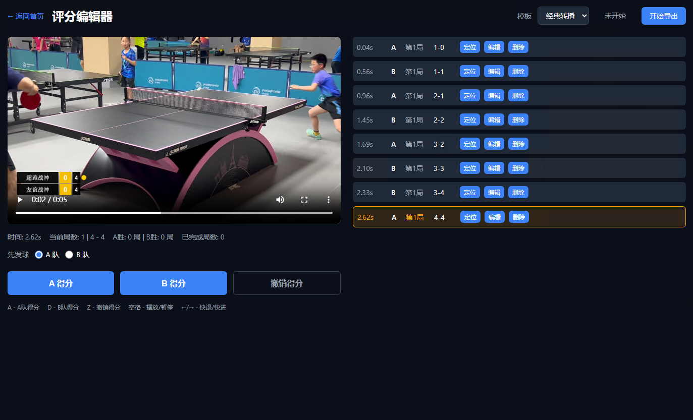
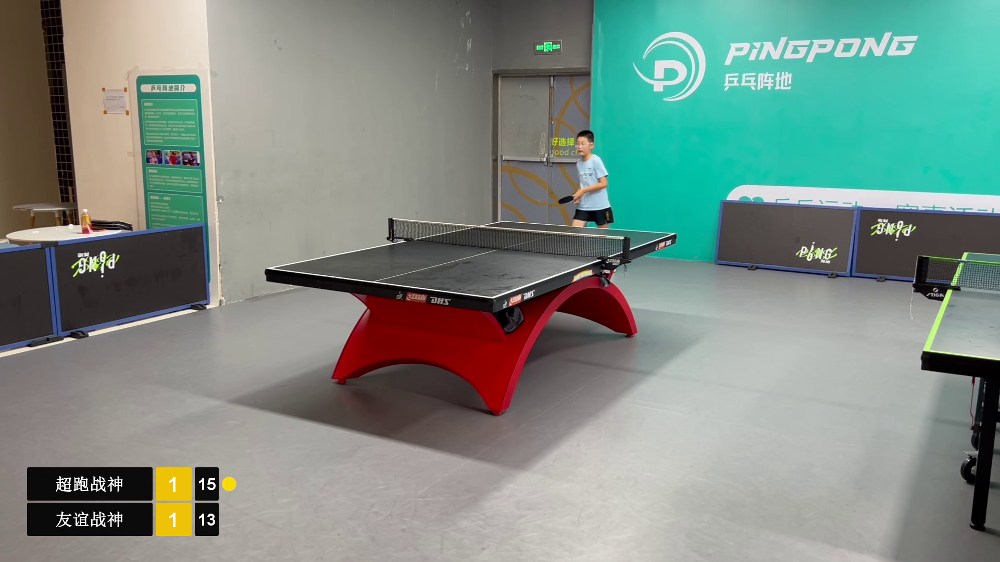

# ScoreSync 乒乓球视频记分与导出工具

[](https://github.com/yejinghua32/scoresync/actions/workflows/ci.yml)
[](https://opensource.org/licenses/MIT)

本地运行的乒乓球视频记分与导出工具：在浏览器中标记得分、即时预览比分牌，并把视频渲染为带比分的 MP4。单进程（Web UI + SQLite + 外部 FFmpeg），无鉴权、无云端依赖。


# 乒乓球比赛视频自动加比分软件

还在用剪映一帧一帧加比分吗？

这是一款专门为乒乓球比赛视频制作开发的软件，可将普通比赛视频快速制作成专业赛事直播风格。

【主要功能】

✔ 导入本地比赛视频

✔ 播放过程中快捷键录入比分

✔ 自动记录每个比分对应时间

✔ 支持后期微调比分时间

✔ 多种赛事比分牌模板

✔ 一键生成带比分的MP4视频

✔ 全程本地运行，无需联网

适用人群：

* 乒乓球俱乐部
* 培训机构
* 学校比赛
* 业余赛事
* 自媒体博主
* 摄影工作室

相比人工剪辑：

以前制作一场比赛可能需要1~2小时，现在十几分钟即可完成。

软件特点：

* Windows本地运行
* 无需专业视频编辑经验
* 操作简单
* 视频无水印
* 可长期使用
* 
## 联系作者
微信 zmipay
欢迎反馈使用问题、BUG反馈、新功能提交。

## 环境
- Java 17
- Maven 3.9+
- 可选：FFmpeg / FFprobe（仅在导出 MP4 时需要）

## 运行
```powershell
$env:SCORESYNC_DATA_DIR = 'C:\ScoreSyncData'
mvn spring-boot:run
# 或先 mvn clean package 再执行：
java -jar target\score-sync-0.0.1-SNAPSHOT.jar
```

打开 `http://localhost:5574/`，依次添加视频目录、扫描或选择单个视频、创建项目、在编辑器中用 A/D 记分。



## 固定快捷键
- A - A队得分
- D / B - B队得分
- Z - 撤销得分
- 空格 - 播放/暂停
- 左/右方向键：按设置中的固定秒数跳转（默认 1 秒，键 `scoresync.editor.seek-seconds`）
  ←/→ - 快退/快进

## 导出MP4画面截图


## 数据与备份
SQLite 数据库存放在 `SCORESYNC_DATA_DIR`（默认 `${user.home}/.scoresync`）；视频仅登记原路径，**不会被复制**。使用编辑器"导出 JSON"备份，在视频库页"导入 JSON"恢复；导入前需先登记元信息（大小 + 修改时间）相同的视频。

## 比分牌模板与 MP4 导出（第二阶段）

### 前置依赖
导出 MP4 需要本机安装 FFmpeg 与 FFprobe（`ffmpeg` / `ffprobe` 命令）。Windows 用户若未加入 `PATH`，可通过环境变量指定可执行文件绝对路径：

```powershell
$env:SCORESYNC_FFMPEG_PATH = 'C:\ffmpeg\bin\ffmpeg.exe'
$env:SCORESYNC_FFPROBE_PATH = 'C:\ffmpeg\bin\ffprobe.exe'
mvn spring-boot:run
```

应用启动时不要求 FFmpeg 已安装，仅在执行导出时校验并返回明确错误。

### 操作流程
1. 在编辑器页面"比分牌与导出"面板选择模板：`CLASSIC`（经典转播）或 `MODERN`（现代电竞）。模板选择会立即保存到项目并刷新左下角预览。
2. 播放、暂停或跳转视频时，左下角预览图按服务端权威比分状态刷新。
3. 点击"开始导出"创建一个渲染任务（同一时刻仅允许一个排队或执行中的任务，否则返回 409 与 `RENDER_JOB_ACTIVE`）。
4. 任务运行时显示进度百分比，可点击"取消"终止；取消会清理任务工作目录的临时文件。
5. 任务成功后出现"下载 MP4"链接，下载使用 H.264/AAC 编码的 MP4 文件，分辨率、帧率与源视频一致。

### 导出目录
默认导出目录为 `${user.home}/.scoresync/exports`，渲染工作目录为 `${user.home}/.scoresync/render-work`，可通过 `SCORESYNC_DATA_DIR` 一并覆盖。

## 验收清单

- [ ] 添加包含 .mp4、.webm、.mov 和非视频文件的目录，扫描后仅显示三个视频扩展名
- [ ] 使用"本地选择"登记视频，确认应用数据目录中没有视频副本
- [ ] 创建五局三胜项目，输入 A 11:0、B 12:10、A 11:9，确认局数 A 2:1，当前第 4 局
- [ ] 第 4 局事件添加后，将其时间移到第 1 局中间并更改选手，确认事件排序及各派生分数更新
- [ ] 删除中间事件，确认时间轴标记、事件列表、局分数、已完成局数无残留旧状态
- [ ] A 赢得第 3 局后，尝试按 A 或 D，确认服务器拒绝且数据库事件数不变
- [ ] 导出 JSON；重启应用；重新打开项目确认状态从 SQLite 恢复；在空数据目录中登记匹配视频后导入 JSON 确认等效状态
- [ ] 使用浏览器 DevTools 请求 `/api/media/<registeredID>` 并带 `Range: bytes=0-1`，确认返回 206；请求不存在的 ID 确认返回 404；无 API 以本地路径参数读取文件
- [ ] 选择 CLASSIC 与 MODERN 模板，确认预览图随视频时间和得分事件刷新
- [ ] 选择样例视频对应项目并添加得分事件，分别用两种模板导出 MP4 并下载
- [ ] 任务执行期间再次创建任务，确认返回 409 与 `RENDER_JOB_ACTIVE` 错误码
- [ ] 取消运行中的任务，确认工作目录临时文件被清理
- [ ] 使用 `ffprobe` 验证输出文件：视频流为 h264、音频流为 aac、宽高与帧率与源视频一致

## Phase 1 限制
- 仅支持 .mp4 / .webm / .mov 格式
- 不做视频转码，实际可播放性取决于浏览器编解码器
- 无自定义快捷键
- 无云端同步
